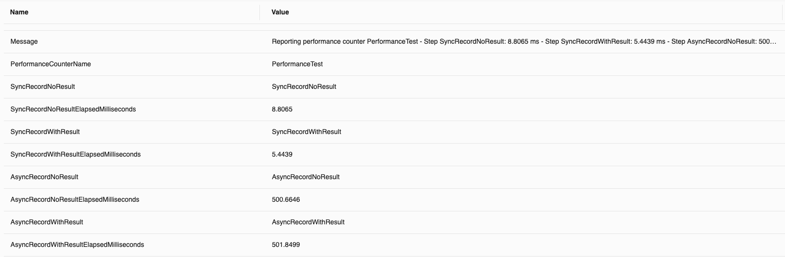

# PerformanceCounter
Simple .NET tool for recording and reporting performance for multipe steps

## Installation

Soon(tm)

## Usage

An example usage could be like the following, taking from one of the samples:
```csharp
app.MapGet("/test", async (ILogger<Program> logger) =>
{
    // Create the counter, this automatically starts the counter and will log to Information
    var performanceCounter = PerformanceCounterFactory.StartDefault(logger, "Test");

    performanceCounter.RecordStep("SyncRecordNoResult", () =>
    {
        foreach (var step in Enumerable.Range(1, 1_000_000))
        {
            var foo = int.MaxValue - step;
        }
    });

    var recordSyncResult = performanceCounter.RecordStep("SyncRecordWithResult", () =>
    {
        var returnResult = int.MaxValue;
        foreach (var step in Enumerable.Range(1, 1_000_000))
        {
            returnResult -= step;
        }

        return returnResult;
    });

    await performanceCounter.RecordStepAsync("AsyncRecordNoResult", async () =>
    {
        await Task.Delay(TimeSpan.FromMilliseconds(500));
    });

    var recordAsyncResult = await performanceCounter.RecordStepAsync(
        "AsyncRecordWithResult", 
        async () =>
        {
            await Task.Delay(TimeSpan.FromMilliseconds(500));
            return 500;
        });

    performanceCounter.StopAndReport();

    return recordAsyncResult + recordSyncResult;
});
```

This produces the following result in the Console:
```
info: Program[0]
      Reporting performance counter Test
      - Step SyncRecordNoResult: 6.6266 ms
      - Step SyncRecordWithResult: 5.3808 ms
      - Step AsyncRecordNoResult: 502.1223 ms
      - Step AsyncRecordWithResult: 501.6494 ms
      - Total elapsed: 1019,2913 ms
```

And the following structured logging:
